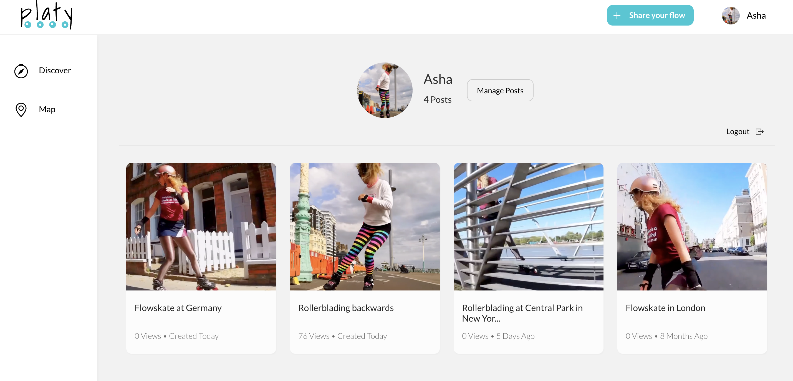
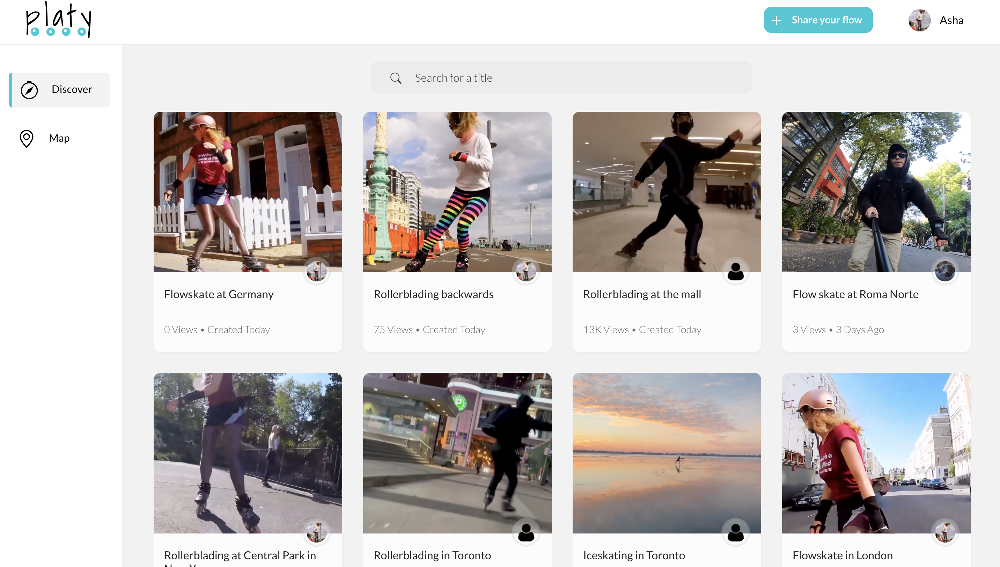
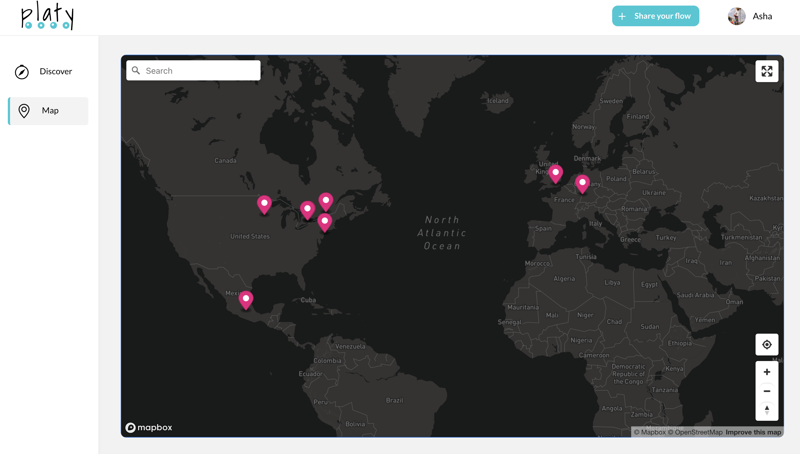
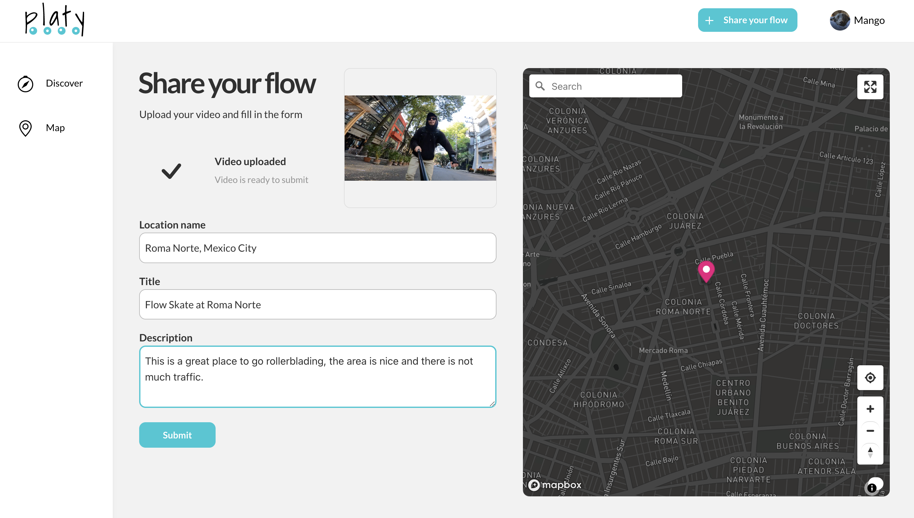

<h1>Platy Front-End</h1>
<i>by Luis</i>

 
 
<h2><b>Visit <a href="https://platy.netlify.app/" width="200px">Platy</a></b></h2>
 
 

Platy is a website where you can find cool places to skate flow. If you are visiting a city for the first time and you want to find a great place to go rollerblading then but you are not sure where to go then Platy is the way to go.
You will find not only the exact location but also a video linked to it so you get more details about the location. If you know a great place to go rollerblading and want to share it you can do it! All you have to do is sign up and once in you can locate the spot on the map, drop a pin and upload a cool video of it.
 
 
How does it work?
<ul>
<li>1. Go to the home page to find the most recet videos.</li>
<li>2. Get more details when you click on the video included the spot where it was recorded.</li>
<li>3. If you prefer you can also go to the Map section, there you can find a map with markers all over the place.</li>
<li>4. If you have some recommendation to share just sing up and go to Share your flow.</li>
<li>5. When sharing a new post you will get asked to drop a pin first so, use the map to locate the spot and click on it to drop a pin.</li>
<li>6. Once the spot has been marked you can then upload a video, this is mandatory before you get to post the new location.</li>
<li>7. The video is uploaded and the spot is located, just submit and the new location will be created.</li>
</ul>
<h2>Page sections</h2>

This is the landing page. Here you will be able to see all the most recent videos. When you hover over the videos they will start to play without sound and if you click on the, it will take you to the actual pos.
 
 
 

This would be the Map section. Here you can see all the markers and if you click on any of them a pop up will appear with a preview of the video and a more details link.
 
 
 

To get here just click the main botton that says Share your flow. Here you can use the map to locate the spot using the search bar, navigation or geolocation is you are in the area.
 
 
 
Those are the main features of the website. You should go take a look at the rest of it!
