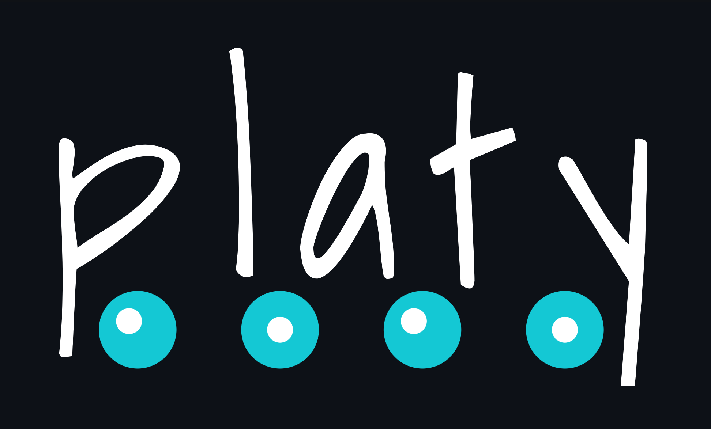
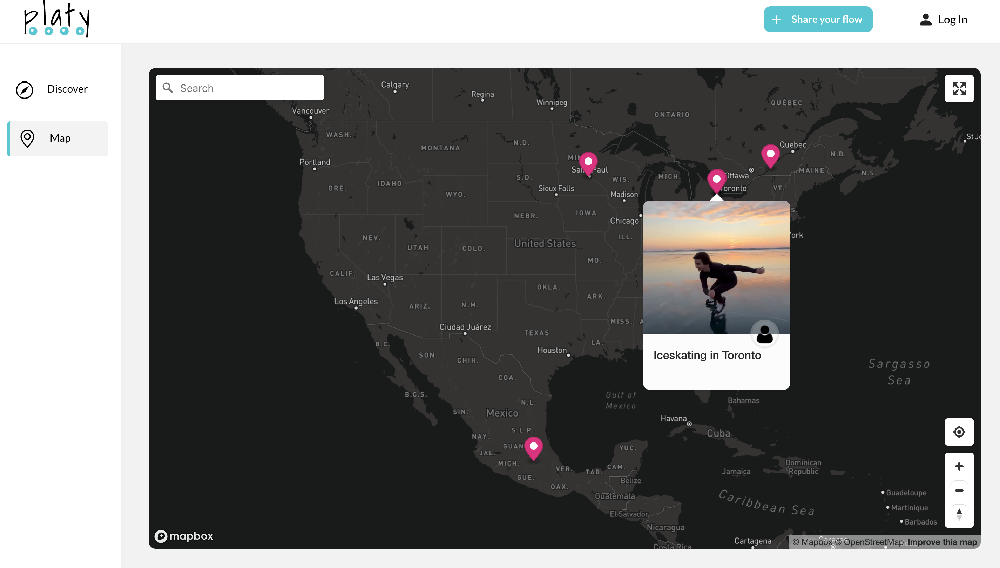

<div align="center" style="margin: 2rem 0;">

<h3>Share & Locate Skateflow Content</h3>
</div>

# About Platy

Platy is a MERN Fullstack Application where you can find places to go rollerblading. You can also watch clips from people around the world rollerblading. If you know a cool spot and want to share it with the community you can sing up, then go to **Share your flow**, drop a pin and attach to it a clip of you rollerblaing. [Take a look](https://platywebsite.netlify.app/).


<br>
<br>
<br>
<br>

# Frontend Introduction

This is the frontend of the application and it has been built as a Single Page Application using the React library. Redux slices is used for managing the application state. The Formik and Yup libraries were used to have better control of the forms and Mapbox is used for the maps. To work with the frontend check the information bellow. If you wish to check the backend of this application instead, go to [Platy Backend](https://github.com/luisbermudez/platy-backend).

<br>
<br>

## Prerequisites

Make sure you have node and yarn installed. You can use the following commands and if installed, you will get their version.

```bash
node -v
yarn -v
```

<br>

## Clone and run the project

1. Clone this repository

```sh
git clone https://github.com/luisbermudez/platy-frontend.git
```

2. Run the yarn command inside the project's directory

```sh
yarn
```

<br>

## Dependencies

- @mapbox/mapbox-gl-geocoder
- @reduxjs/toolkit
- @testing-library/jest-dom
- @testing-library/react
- @testing-library/user-event
- axios
- bootstrap
- dotenv
- formik
- mapbox-gl
- react
- react-bootstrap
- react-bootstrap-icons
- react-dom
- react-redux
- react-router-dom
- react-scripts
- redux
- redux-thunk
- web-vitals
- yup
  <br>

If you are missing any of the dependencies above run: yarn add **name-of-dependency**. For instance, to add **@mapbox/mapbox-gl-geocoder** the command would be:

```bash
yarn add bc@mapbox/mapbox-gl-geocoderryptjs
```

<br>

## Scripts

Use yarn start to get the frontend running.

```sh
yarn start
```

<br>
<br>
